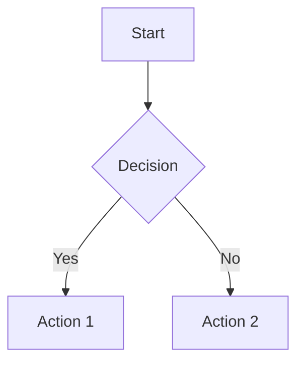

# Comprehensive Markdown Example Document

This document demonstrates all supported markdown token types in the Wonder Editor.

## Text Formatting

**Bold text** and *italic text* and ~~strikethrough text~~.

Here's some `inline code` and a paragraph of regular text.

### Code Blocks

```rust
fn main() {
    println!("Hello, World!");
}
```

```
Plain code block without language
```

## Links and Images

Visit [this link](https://example.com) for more information.

Here's an image: 

## Lists

Unordered list:
- First item
- Second item
- Third item

Task list:
- [ ] Unchecked task
- [x] Checked task
- [ ] Another unchecked task

## Block Elements

> This is a blockquote
> with multiple lines
> of quoted content.

---

## Tables

| Header 1 | Header 2 | Header 3 |
|----------|----------|----------|
| Cell 1   | Cell 2   | Cell 3   |
| Data A   | Data B   | Data C   |

| Left | Center | Right |
|:-----|:------:|------:|
| L1   | C1     | R1    |
| L2   | C2     | R2    |

## Special Elements (Future Support)

Text with footnote[^1] reference.

[^1]: This is a footnote definition.

==Highlighted text== for emphasis.

#tag #work/project #urgent tags in text.

%% This is a comment that should be hidden in preview %%

> [!info] 
> This is an info callout

> [!warning] Important Warning
> Be careful with this!

Math expressions: $x^2 + y^2 = z^2$ and block math:

$$\sum_{i=1}^n x_i = \frac{n(n+1)}{2}$$

Internal links: [[Another Document]] and [[Document Name|Custom Alias]].

Emoji support: 😀 🚀 ❤️ 👍 🎉



HTML elements: H<sub>2</sub>O and E = mc<sup>2</sup>

## Mixed Content Test

This paragraph contains **bold**, *italic*, `code`, [links](https://example.com), and ~~strikethrough~~ all together.

### Nested Formatting

**Bold with *italic* inside** and *italic with **bold** inside*.

### Complex Lists

1. First numbered item
2. Second with **bold**
3. Third with `code`
   - Nested unordered
   - Another nested
     - Deep nesting
4. Fourth item

## End of Document

This comprehensive example covers all current and planned markdown token types for the Wonder Editor.